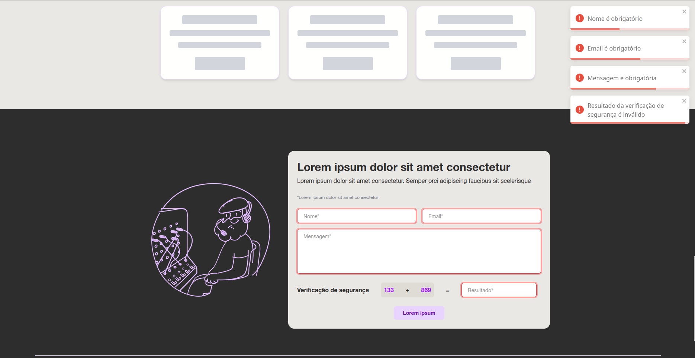
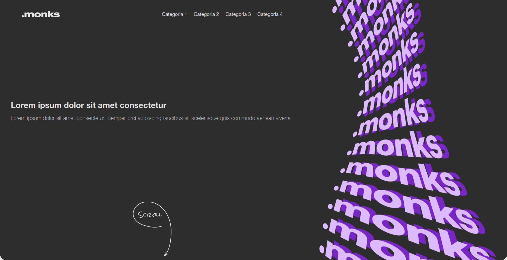
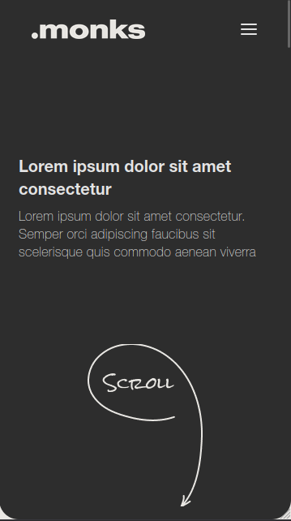
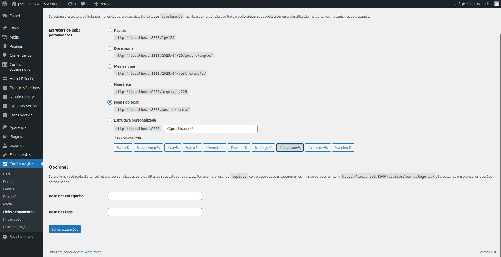
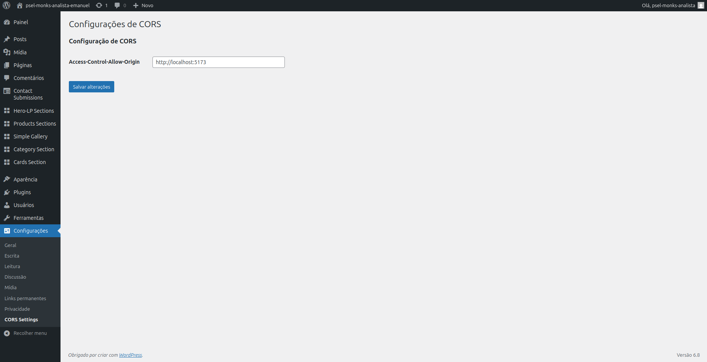

# 💼 Case PSEL - Monks

> Projeto desenvolvido para o processo seletivo da Monks, com o objetivo de construir uma landing page responsiva a partir de um mockup em Figma, utilizando React e WordPress como backend.

---

## 🎯 Objetivo

Construir uma landing page totalmente dinâmica, onde os textos, imagens, links e cards são carregados da API REST do WordPress. O projeto foi desenvolvido em duas partes:

- **Frontend**: React + Vite + TailwindCSS + TypeScript
- **Backend**: WordPress como headless CMS, rodando em container Docker

---

## 🚀 Tecnologias Utilizadas

### Frontend

- React
- Vite
- TypeScript
- TailwindCSS
- React Toastify

### Backend

- WordPress
- PHP (Custom Post Types e Endpoints)
- Docker

---

## 🧩 Funcionalidades

- ✅ Página 100% responsiva com base no mockup
- ✅ Consumo dinâmico de dados via API do WordPress
- ✅ Validação de formulário com feedback visual via toast:
  
- ✅ Verificação cruzada entre frontend e backend com código de soma
- ✅ Salva os dados do formulário em um Custom Post Type

---

## 📸 Prévia do Projeto

### 🖥️ Desktop



### 📱 Mobile



---

## 🛠️ Instruções de Inicialização

### Requisitos

- Docker + Docker Compose

### Inicializar todo o projeto

```bash
git clone https://github.com/Emanuelsmcastro/psel-monks-analista-emanuel.git
cd psel-monks-analista-emanuel
docker-compose up -d --build ou docker compose up -d --build
```

Acesse:

- Frontend: [http://localhost:4173](http://localhost:4173)
- Backend (WordPress): [http://localhost:8000](http://localhost:8000)

---

## ⚙️ Configuração da API WordPress

Após acessar o painel do WordPress, siga estes passos para ativar corretamente a API e permitir o consumo no frontend:

1. **Ative o tema** `psel-monks-theme` nas configurações de aparência.

2. **Configure os Permalinks** para o formato _Nome do post_:

   - Vá em **Configurações** → **Links permanentes**
   - Marque a opção _Nome do post_
   - Clique em **Salvar alterações**

   

3. **Configure a origem permitida no CORS**:

   - Acesse a aba **CORS da Aplicação** que aparece no menu _Configurações_ após ativar o tema
   - Insira `http://localhost:4173` como URL permitida
   - Clique em **Salvar alterações**

   

---

## 🔐 Variáveis de Ambiente

### Arquivo `.env` (raiz do projeto)

```env
DB_NAME=wordpress
DB_USER=wordpress
DB_PASSWORD=wordpress
DB_ROOT_PASSWORD=wordpress
```

### Frontend

```env
VITE_API_URL=http://localhost:8000/wp-json
```

---

## 📂 Estrutura de Diretórios

```
├── backend
│   └── wordpress/wp-content/themes/psel-monks-theme
│       ├── functions.php
│       ├── inc/
│       ├── style.css
│       └── template-parts/
│
└── frontend
    ├── src/
    │   ├── components/
    │   ├── services/wordpress.ts
    │   └── types/globalTypes.ts
```

---

## 📄 Documentação

Para instruções mais detalhadas de configuração, uso e arquitetura do projeto, acesse:

👉 [WORDPRESS](./docs/WP-DOC.md)

👉 [FRONTEND](./docs/FRONT-DOC.md)

---

## 👤 Autor

Feito com 💻 por **Emanuel Castro** para o processo seletivo da **Monks**.

[🔗 LinkedIn](https://www.linkedin.com/in/emanuel-castro-dev/)

---
