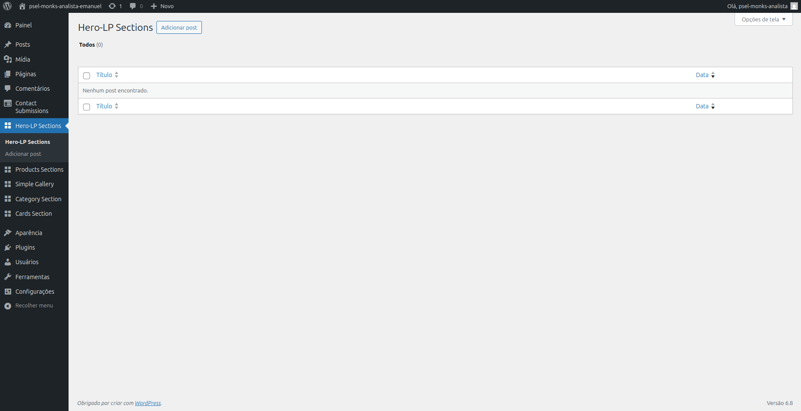
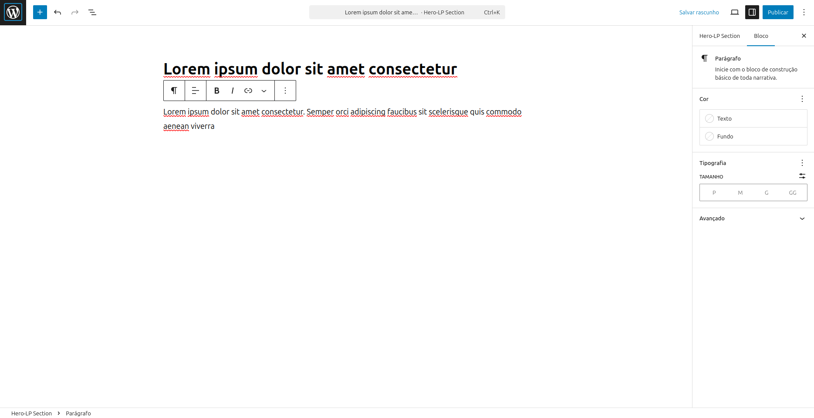
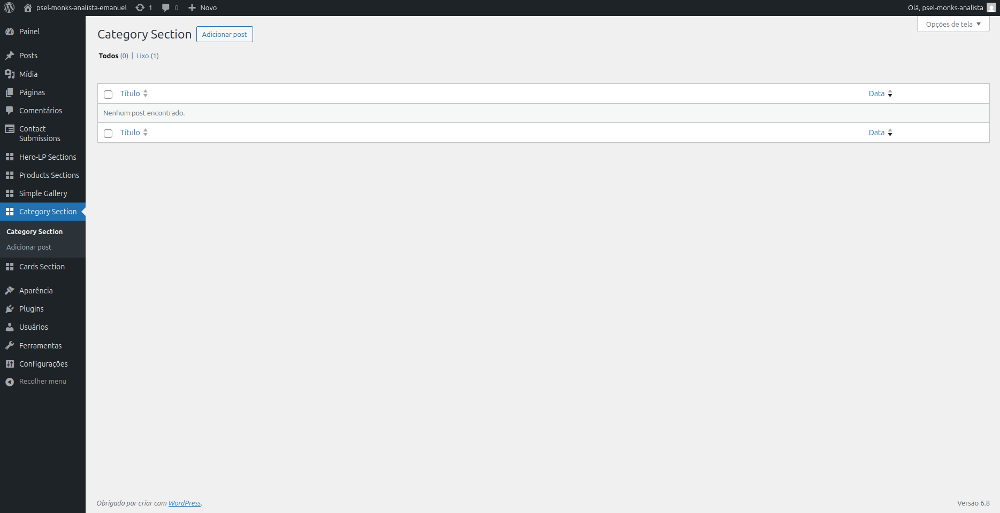
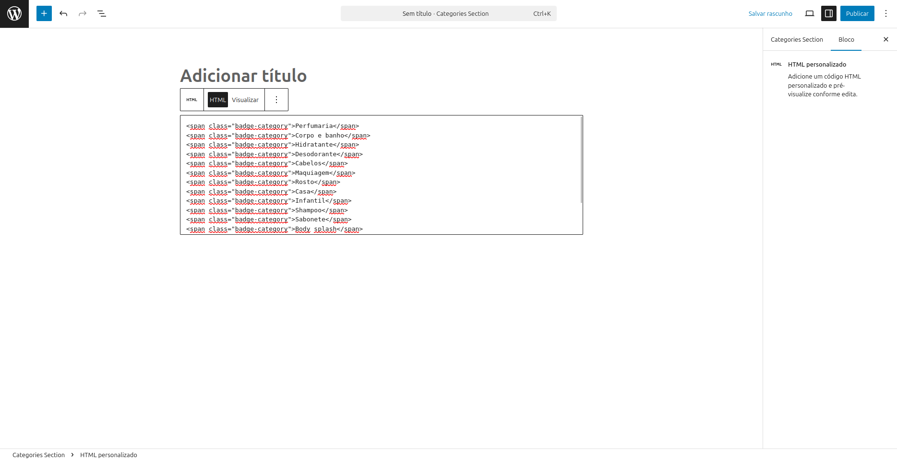
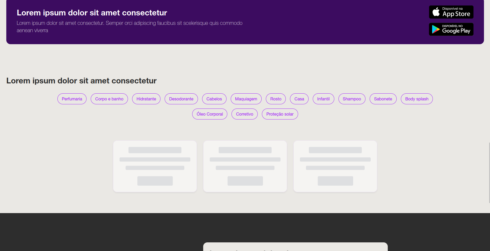

# 📝 Guia de Preenchimento das Seções no WordPress

Este documento foi criado para auxiliar no preenchimento correto dos dados no painel administrativo do WordPress, utilizando os **Custom Post Types** criados pelo tema `psel-monks-theme`.

---

## 📍 Onde preencher

Acesse o painel do WordPress e utilize o menu lateral esquerdo, onde cada seção da landing page está representada por um tipo de post personalizado (Custom Post Type).

Cada seção da landing page deve conter **um ou mais posts**, dependendo do tipo de conteúdo.

📸 **Exemplos visual:**

- Hero-LP

  - Menu
    
  - Preenchimento
    
  - Resultado no Frontend
    

---

- Category Section
  - Menu
    
  - Preenchimento
    
  - Resultado no Frontend
    

---

## 🧱 Seções e seus campos

### 1. `Hero-LP Section`

- Título: visível na parte superior da landing page
- Conteúdo: subtítulo ou parágrafo
- Imagem destacada: não utilizada (opcional)

### 2. `Products Section`

- Cada item representa um bloco de produto
- Título: nome do item
- Conteúdo: breve descrição
- Imagem destacada: imagem do produto

### 3. `Simple Gallery`

- Cada item representa uma imagem da galeria
- Título: opcional
- Conteúdo: opcional
- Imagem destacada: imagem principal da galeria

### 4. `Categories Section`

- Apenas 1 item necessário
- Título: opcional
- Conteúdo: aqui deve ser inserido **HTML puro** com as categorias (badges)
- Imagem destacada: não utilizada (opcional)

💡 **Exemplo de conteúdo válido**:

```html
<span class="badge-category">Perfumaria</span>
<span class="badge-category">Corpo e banho</span>
<span class="badge-category">Hidratante</span>
<span class="badge-category">Desodorante</span>
<span class="badge-category">Cabelos</span>
<span class="badge-category">Maquiagem</span>
<span class="badge-category">Rosto</span>
<span class="badge-category">Casa</span>
<span class="badge-category">Infantil</span>
<span class="badge-category">Shampoo</span>
<span class="badge-category">Sabonete</span>
<span class="badge-category">Body splash</span>
<span class="badge-category">Óleo Corporal</span>
<span class="badge-category">Corretivo</span>
<span class="badge-category">Proteção solar</span>
```

### 5. `Cards Section`

- Cada item representa um card
- Título: texto do card
- Conteúdo: descrição
- Imagem destacada: não utilizada (opcional)

---

## ✅ Dicas Rápidas

- Sempre salve os posts como **Publicado**.
- As imagens devem ser otimizadas (tamanho ideal: até 300~800px de largura).
- Use o botão "Atualizar" após qualquer modificação.
- Para ver os dados no frontend, apenas recarregue a página React (não é necessário rebuild).

---

Se algo não aparecer no frontend após preenchido, verifique:

- O post foi publicado?
- O campo imagem destacada está configurado (quando necessário)?
- O conteúdo HTML foi salvo corretamente?
- O container Docker está rodando?

Para dúvidas ou erros, consulte a documentação principal do projeto ou entre em contato.
